<p align="center">
  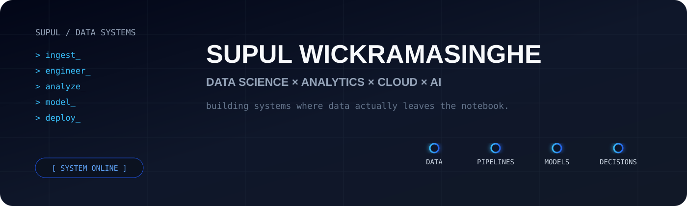
</p>

<p align="center">
  <a href="https://www.linkedin.com/in/supul-wickramasinghe">
    
  </a>
  <a href="https://github.com/supulwickramasinghe?tab=repositories">
    
  </a>
  
</p>

```yaml
supul@github
─────────────────────────────────
role       → Junior Data Scientist
focus      → Data × ML × Cloud
building   → systems beyond notebooks
location   → Colombo, Sri Lanka
```

---

## `01 / TECH I ACTUALLY WORK WITH`

<p align="center">
  
</p>

<p align="center">
  
  &nbsp;&nbsp;&nbsp;
  
  &nbsp;&nbsp;&nbsp;
  
  &nbsp;&nbsp;&nbsp;
  
</p>

<p align="center">
  <code>Microsoft Fabric</code> ·
  <code>Power BI</code> ·
  <code>Databricks</code> ·
  <code>PySpark</code> ·
  <code>Delta Lake</code> ·
  <code>OneLake</code>
  <br>
  <code>Azure ML</code> ·
  <code>MLflow</code> ·
  <code>BigQuery</code> ·
  <code>Cloud Run</code> ·
  <code>Docker</code> ·
  <code>GitHub Actions</code>
  <br>
  <code>Scikit-learn</code> ·
  <code>XGBoost</code> ·
  <code>CatBoost</code> ·
  <code>SHAP</code> ·
  <code>TensorFlow</code> ·
  <code>PyTorch</code>
  <br>
  <code>LangChain</code> ·
  <code>RAG</code> ·
  <code>FAISS</code> ·
  <code>AI Agents</code>
</p>

---

## `02 / SELECTED BUILDS`

<table>
<tr>
<td width="33%" align="center" valign="top">

<a href="https://github.com/supulwickramasinghe/telecom-customer-churn-analytics-mlops">
  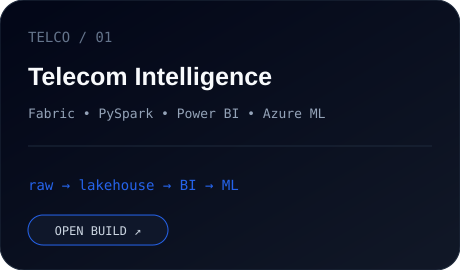
</a>

### Telecom Intelligence Platform

`Fabric` `PySpark` `Power BI`  
`Azure ML` `MLflow`

Raw telecom data → governed lakehouse → BI → churn ML.

<a href="https://github.com/supulwickramasinghe/telecom-customer-churn-analytics-mlops">
  
</a>

</td>
<td width="33%" align="center" valign="top">

<a href="https://github.com/supulwickramasinghe/algorithmic-trading-finnhub-gcp">
  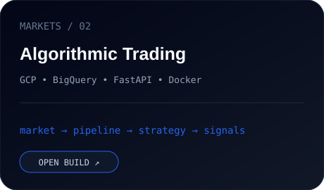
</a>

### Algorithmic Trading Platform

`GCP` `BigQuery` `FastAPI`  
`Docker` `GitHub Actions`

Market data → cloud pipeline → strategy → trading signals.

<a href="https://github.com/supulwickramasinghe/algorithmic-trading-finnhub-gcp">
  
</a>

</td>
<td width="33%" align="center" valign="top">

<a href="https://github.com/supulwickramasinghe/hotel-cancellation-prediction">
  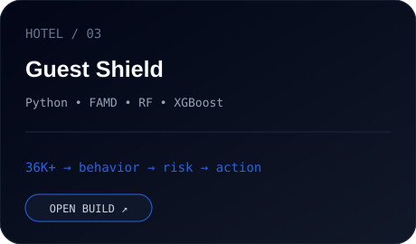
</a>

### Guest Shield

`Python` `FAMD` `Random Forest`  
`XGBoost` `SHAP`

36K+ reservations → behavior → risk → business action.

<a href="https://github.com/supulwickramasinghe/hotel-cancellation-prediction">
  
</a>

</td>
</tr>
</table>

<p align="center">
  <a href="https://github.com/supulwickramasinghe?tab=repositories">
    
  </a>
</p>

---

## `03 / CREDENTIALS.UNLOCKED`

<p align="center">
  <sub>click any badge → verify credential</sub>
</p>

<table align="center">
<tr>

<td align="center" width="16.6%">
<a href="https://learn.microsoft.com/api/credentials/share/en-us/SupulWickramasinghe-2893/231E7F18A1AB5C1A?sharingId">

</a>
<br><b>Microsoft Certified</b>
<br><sub>Fabric Analytics Engineer Associate</sub>
</td>

<td align="center" width="16.6%">
<a href="https://www.credly.com/badges/23fe0361-8b24-47b2-a7b2-51f5f415302f/linked_in_profile">
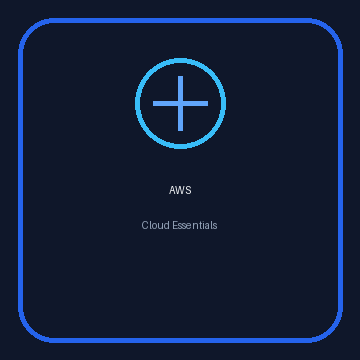
</a>
<br><b>AWS Knowledge</b>
<br><sub>Cloud Essentials</sub>
</td>

<td align="center" width="16.6%">
<a href="https://credentials.databricks.com/c1d1f960-74b0-4bd9-b7f0-d37be5e2b0e0">
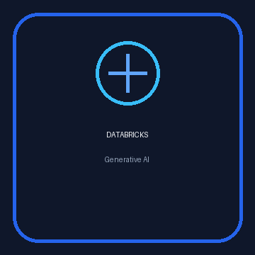
</a>
<br><b>Databricks</b>
<br><sub>Generative AI Fundamentals</sub>
</td>

<td align="center" width="16.6%">
<a href="https://credentials.databricks.com/169efd50-9141-49b9-b5ee-1bcb8bad1c07">
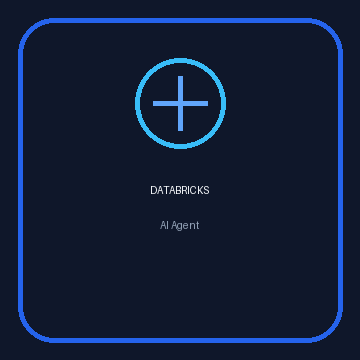
</a>
<br><b>Databricks</b>
<br><sub>AI Agent Fundamentals</sub>
</td>

<td align="center" width="16.6%">
<a href="https://credentials.databricks.com/6b5aac8d-3a24-441c-b8e9-4e52c1b97922">
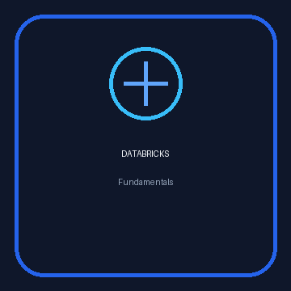
</a>
<br><b>Databricks</b>
<br><sub>Databricks Fundamentals</sub>
</td>

<td align="center" width="16.6%">
<a href="https://credentials.databricks.com/bb8bfdd9-b37e-46a8-a864-16fe234f4bc8">
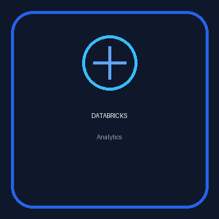
</a>
<br><b>Databricks</b>
<br><sub>Analytics Fundamentals</sub>
</td>

</tr>
</table>

<details>
<summary><b>+ load more credentials</b></summary>

<br>

<table>
<tr>

<td align="center" width="33%">
<a href="https://www.credly.com/badges/d2ae714d-d6f7-4c19-ba76-3b0aa525a79c/linked_in_profile">

</a>
<br><b>AWS Educate</b>
<br><sub>Introduction to Cloud 101</sub>
</td>

<td align="center" width="33%">
<a href="https://www.credly.com/badges/e49a5d64-71c9-4e19-8e99-9373fa51d9d9/linked_in_profile">
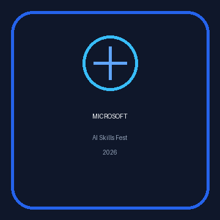
</a>
<br><b>Microsoft</b>
<br><sub>AI Skills Fest 2026</sub>
</td>

<td align="center" width="33%">
<a href="https://credentials.databricks.com/e3ee6534-5446-403d-8a8b-e671afaca995">
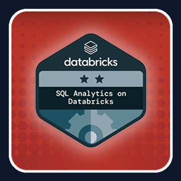
</a>
<br><b>Databricks</b>
<br><sub>SQL Analytics on Databricks</sub>
</td>

</tr>
</table>

</details>

---

## `04 / CURRENTLY.RUNNING`

<table>
<tr>
<td width="50%" valign="top">

```python
while curious:
    learn()
    build()
    break_things()
    understand_why()
    ship()
```

</td>

<td width="50%" valign="top">

**Junior Data Scientist @ Smartzi**

Pricing analytics, automation, BI and machine-learning work around airport ground transportation.

`1–2 days → < 1 hour`

on one recurring pricing workflow.

</td>
</tr>
</table>

---

## `05 / GITHUB PULSE`

<p align="center">
  
</p>

<details>
<summary><b>+ open contribution radar</b></summary>

<br>

<p align="center">
  
</p>

</details>

<br>

<p align="center">
<picture>
  <source
    media="(prefers-color-scheme: dark)"
    srcset="https://raw.githubusercontent.com/supulwickramasinghe/supulwickramasinghe/output/github-contribution-grid-snake-dark.svg"
  />
  <source
    media="(prefers-color-scheme: light)"
    srcset="https://raw.githubusercontent.com/supulwickramasinghe/supulwickramasinghe/output/github-contribution-grid-snake.svg"
  />
  
</picture>
</p>

## `06 / DON'T JUST READ THE README`

<p align="center">
  <a href="https://github.com/supulwickramasinghe?tab=repositories">
    
  </a>

  <a href="https://www.linkedin.com/in/supul-wickramasinghe">
    
  </a>
</p>

<p align="center">
  <code>data → systems → decisions</code>
</p>